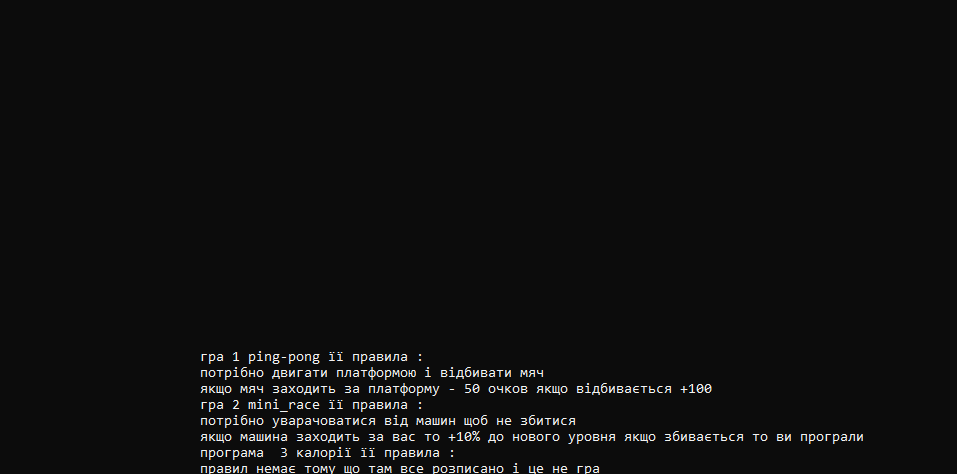
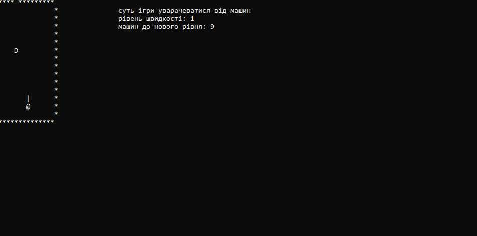

# mini.play.market
mini_play_market
## hi
- hi
- test

* [ ] hi
* [x] hi
* [x] hi

```
	else
						if (KEY[13])
						{
							if (gde == 1) {
								what_1 = 2;
							}
							else if (gde == 2) {
								what_1 = 3;
							}

						}
```
---
test `test` *test*

**test**

1. test1
2. 5
3. 4
4. 4
5. 4

[click](https://github.com/Hiago2007/mini.play.market/tree/master)





