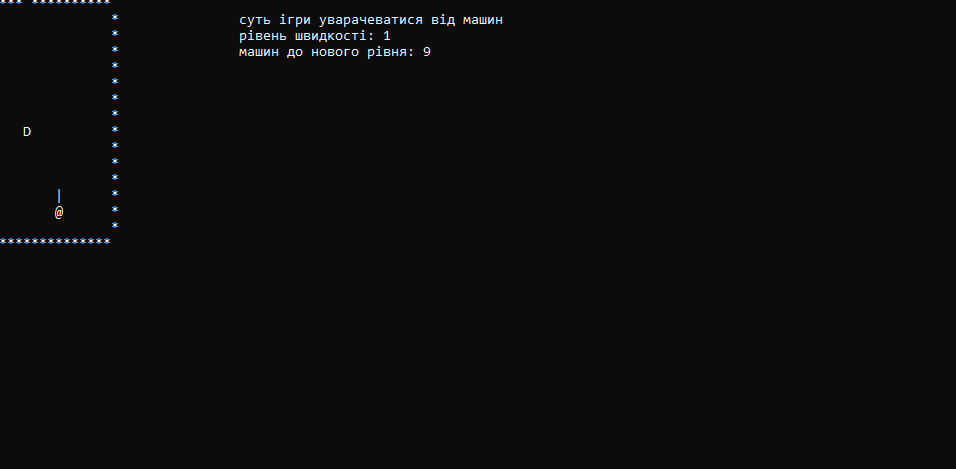

# MINI_GOOGLE_PLAY

--- 

## `Добрий день ви вішли в  MINI_GOOGLE_PLAY`

---
## `план репозиторію`:
1. **розповіти що за програма що в ній є**
3. **показати скріншоти з програми**
4. **поставити частину коду над яким я більше всього думав**
5. **скільки часу робив**
6. **особисті дані розроботчика**
7. **що зроблено що потрібно добавити**

---

# план роботи №1:
## це програма пародія на звичайний play_market(або google_play) в ній покашто тіки 2 гри а саме:
## **1)гра pong(або ping_pong)**
## **2)гра mini_race(міні_гонка)**
## розповідь за програму №1:
## в цій грі є 2 режима :
## режим №1:
## ви управляете платформою(верх-вниз) клавишами стрілочками які знаходяться справа клавіатури суть гри щоб мячик не попав за платформу якщо попадає то - 50 очків якщо ви відбили мячик то + 100 очків по цьому режиму всьо
## режим №2:
## для цього режиму нужно 2 ігроків в цьому режимови суть такаже тіки щочика немає очків і управлєніє виповняется за допомогою стрілочок(верх-вниз) і клавишами w-s
## розповідь за програму №2:
## в цій грі є 3 режима :
## режим №1:
## в цій грі ви управляете шось на подобію машини вправо-вліво управлєніє робиться за допомогою стрілочок(вправо-вліво) і потрібно не зибится в машини з каждими 10 машинами швидкість збільшується вона буде збільшуватися поки ви не програєте і в цьому режиму їде тіки 1 машина
## режим №2:
## ця гра аналогічна тіки їду вже 2 машини а так все одинаково і тут складніше увернутися
## режим №3:
## ця гра аналогічна тіки їду вже 3 машини а так все одинаково і тут складніше увернутися
# план роботи №2:
## авторизація 

## вход або регестрація акаунта

## меню

## правила ігор

## вибор гри

## гра пін понг вибор режима

## режим на 1 в грі(pong)

## режим на 2 в грі(pong)

## вибор режима в грі mini_race

##  режим 1

##  режим 2


##  режим 3

# план роботи №3:
```
if (perevirka == 1) {

						if (obman_y == 1 or obman_y == 13 or obman_x == 23 or obman_x == 2) {

							or_or = 1 + rand() % (3);

						}


						if (obman_y == i or obman_y == i1 or obman_y == i2) {
							if (obman_x == 3) {
								or_or = 1 + rand() % (3);
							}
						}

						if (x_y1 == 1) {


							if (or_or == 1) {
								if (obman_y < 14 and obman_x < 24 and obman_y > 0) {

									if (obman_y == i or obman_y == i1 or obman_y == i2) {
										if (obman_x == 3) {
											perevirka = 1;
										}
									}


									perenos(obman_x, obman_y);
									cout << " ";

									obman_x++;
									obman_y++;
									if (obman_x >= 24) {
										obman_x = 23;
									}
									perenos(obman_x, obman_y);
									cout << "o";

									Sleep(85);


								}
							}

							else
								if (or_or == 2) {
									if (obman_y < 14 and obman_x < 24 and obman_y > 0) {

										if (obman_y == i or obman_y == i1 or obman_y == i2) {
											if (obman_x == 3) {
												perevirka = 1;
											}
										}


										perenos(obman_x, obman_y);
										cout << " ";
										obman_x++;
										obman_x++;
										obman_y++;
										if (obman_x >= 24) {
											obman_x = 23;
										}
										perenos(obman_x, obman_y);
										cout << "o";


										Sleep(85);


									}
									if (obman_x == 21) {
										or_or = 1;
									}
								}

								else
									if (or_or == 3) {
										if (obman_y < 14 and obman_x < 24 and obman_y > 0) {

											if (obman_y == i or obman_y == i1 or obman_y == i2) {
												if (obman_x == 3) {
													perevirka = 1;
												}
											}


											perenos(obman_x, obman_y);
											cout << " ";

											obman_x++;
											obman_y++;
											obman_y++;
											if (obman_x >= 24) {
												obman_x = 23;
											}
											perenos(obman_x, obman_y);
											cout << "o";


											Sleep(85);


										}
										if (obman_y == 11) {
											or_or = 1;
										}
									}


							if (obman_y == 12) {
								x_y1 = 2;

							}

							if (obman_x == 22) {
								perevirka = 2;
							}


							//50\50


						}
						//право-верх
						if (x_y1 == 2) {

							if (or_or == 1) {
								if (obman_y < 14 and obman_x < 24 and obman_y > 0) {

									if (obman_y == i or obman_y == i1 or obman_y == i2) {
										if (obman_x == 3) {
											perevirka = 1;
										}
									}


									perenos(obman_x, obman_y);
									cout << " ";

									obman_x++;
									obman_y--;
									if (obman_x >= 24) {
										obman_x = 23;
									}
									if (obman_y == 0) {
										obman_y = 1;
									}
									perenos(obman_x, obman_y);
									cout << "o";

									Sleep(85);


								}
							}

							else
								if (or_or == 2) {
									if (obman_y < 14 and obman_x < 24 and obman_y > 0) {

										if (obman_y == i or obman_y == i1 or obman_y == i2) {
											if (obman_x == 3) {
												perevirka = 1;
											}
										}


										perenos(obman_x, obman_y);
										cout << " ";
										obman_x++;
										obman_x++;
										obman_y--;
										if (obman_x >= 24) {
											obman_x = 23;
										}
										if (obman_y == 0) {
											obman_y = 1;
										}
										perenos(obman_x, obman_y);
										cout << "o";


										Sleep(85);


									}
									if (obman_x == 21) {
										or_or = 1;
									}
								}

								else
									if (or_or == 3) {
										if (obman_y < 13 and obman_x < 23 and obman_y > 0) {
											if (obman_y == i or obman_y == i1 or obman_y == i2) {
												if (obman_x == 3) {
													perevirka = 1;
												}
											}


											perenos(obman_x, obman_y);
											cout << " ";

											obman_x++;
											obman_y--;
											if (obman_x >= 24) {
												obman_x = 23;
											}
											obman_y--;
											if (obman_y == 0) {
												obman_y = 1;
											}
											perenos(obman_x, obman_y);
											cout << "o";


											Sleep(85);


										}
										if (obman_y == 2) {
											or_or = 1;
										}

										if (obman_y == 0) {
											cout << "*";
											perenos(obman_x, 1);
											cout << "o";
											x_y1 = 1;
										}
									}


						}


						if (obman_y == 12) {
							x_y1 = 2;

						}
						if (obman_y == 1) {
							x_y1 = 1;

						}
						if (obman_x == 22) {
							perevirka = 2;
						}
						if (obman_y == 140) {
							for (int i = 0; i < right; i++) {
								cout << "*";
							}

							x_y1 = 1 + rand() % (2);
							obman_y = 13;

						}


						if (obman_x == 0) {
							perevirka = 2;
						}

						if (obman_y == 0) {
							cout << "*";
							perenos(obman_x, 1);
							cout << "o";
							x_y1 = 1;
						}

					}

```
## ця частина коду взяти з обробки на мяч це тыки половина ящо не менше над цыэю частиною думан довше а 2 частину просто чуть чуть змінити
# план роботи №4:
## робив 1 мысяць ы там несколько днів(+- 1-3 днів)
# план роботи №5:
CODE DEVELOPER [INSTAGRAM](https://instagram.com/kerul257?igshid=YmMyMTA2M2Y=)

Repositories [GITHUB](https://github.com/Hiago2007/mini.play.market)
# план роботи №6:
* [X] зробити авторизацію
* [x] зробити меню
* [x] зробити мінімум 2 гри
* [x] зробити мінімум 2 рижима в каждій грі
* [x] зробити гру пін-понг
* [x] зробити груmini_race
* [x] зробити сайт до програми
* [x] зробити репозиторій в github
* [X] зробити файл readmi
* [ ] здати проект
* [ ] захистити свій проект


---


